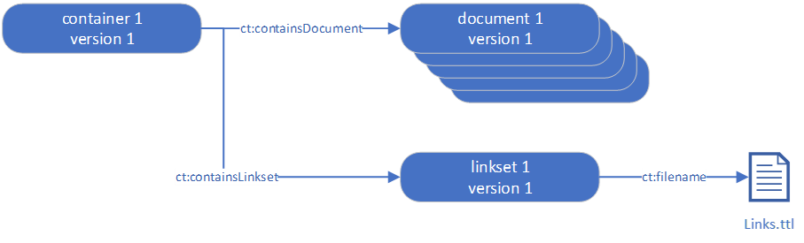
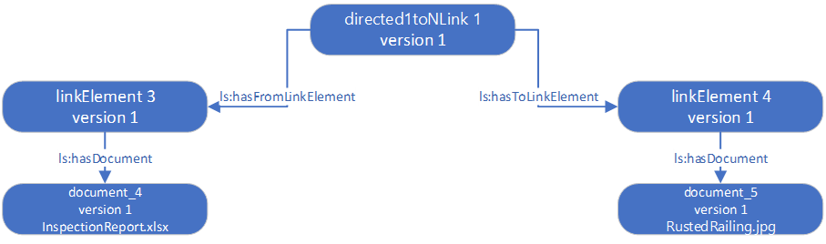
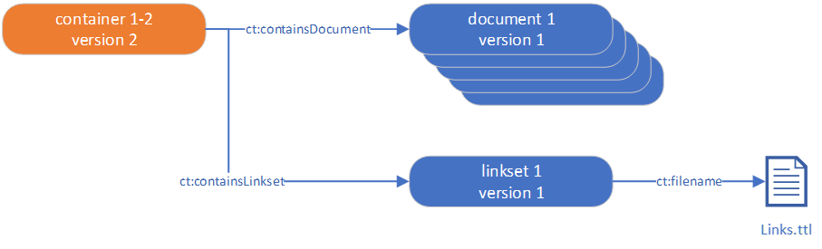
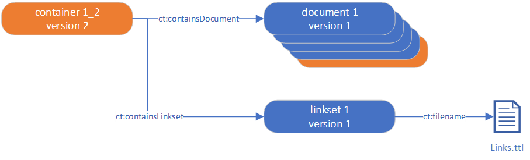
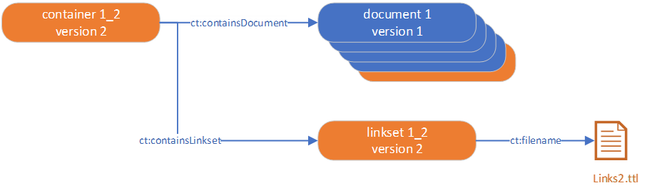
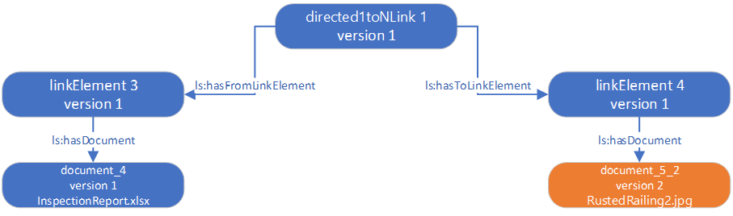
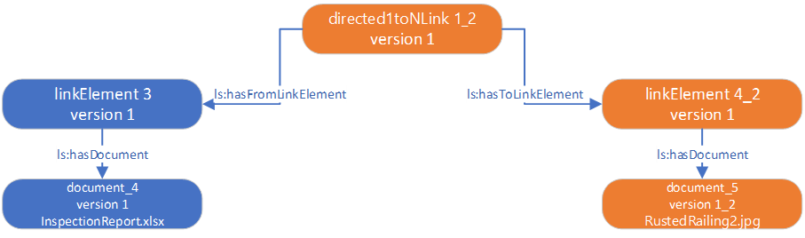

# Points to aid data quality 

As mentioned in NEN-EN-ISO 21597-1:2020, the ability to specify relationships using links between information elements in separate documents can contribute significantly to the value of an information delivery. The link may be interpreted by the recipient applications or reviewed interactively by the recipient. Where it includes link references into the content of documents that do not support standardized querying mechanisms, their resolution may depend on third party interpreters. 

In the exchanged container the links are exchanged in the “Payload triples” folder. The links are structured as defined in Links.rdf. Here we will use the Turtle serialisation for convenient reading. The following prefixes are used throughout the examples (other than standard W3C vocabularies such as RDF): 

>```
>ct: the Container ontology 
>ls: the Linkset ontology 
>els: the extended Linkset ontology (part 2 of the ICDD standard) 
>index: the index file 
>ex: example content
>```

An example of a binary link: 

>```
>ex:l01fe6d15-2ba0-4bc2-b338-1c5a84de6f09 
>  rdf:type els:IsIdenticalTo ; 
>  ct:createdBy index:idad118169-4c6a-4afe-9c2a-5d21e6f2a602 ; 
>  ct:creationDate "2018-05-28T14:13:28.167"^^xsd:dateTime ; 
>  ct:versionDescription "first version" ; 
>  ct:versionID "1" ; 
>  ls:hasLinkElement ex:le3c2bd8ac-91f4-4b98-93cc-2548437f0324 ; 
>  ls:hasLinkElement ex:led067b5ac-d8a6-462b-9a15-88c87f4742d8 ; 
>.
>```

ex:l01fe6d15-2ba0-4bc2-b338-1c5a84de6f09 identifies the link. The id should be consistent within the container, which will be discussed more in-depth later in this document, in the section on the process of creating links. The link in this example is classified as an els:IsIdenticalTo link, which is a subclass of a ls:BinaryLink. 

ct:createdBy index:idad118169-4c6a-4afe-9c2a-5d21e6f2a602 is the reference to a person, defined elsewhere in the link set. 

The actual link is defined as follows in this example: 

>```
>ls:hasLinkElement ex:le3c2bd8ac-91f4-4b98-93cc-2548437f0324 ; 
>
>ls:hasLinkElement ex:led067b5ac-d8a6-462b-9a15-88c87f4742d8 ; 
>```
 

It is good practice to assign a version number to the link. Here, as the example concerns a first version of the link, the snippet uses ct:versionID "1" and 
ct:versionDescription "first version". 

  

The ct:versionID and corresponding ct:versionDescription of a link are optional, but provide the opportunity to maintain versioning of links. If for instance only one link in the whole link set changes, namely a link to a renamed timesheet, all other links are unchanged. In this case the link set’s ct:versionID and ct:versionDescription change with only the link to the timesheet changed and all other links will remain the same. This is explained in the next paragraph. 

 

## Process of creating links 

Links are produced interactively or created by the sender’s application(s). The creation of links will be discussed here and shown with different ambition levels for versioning. 

In the container file an index.ttl file and a links.ttl file persist. The index.ttl file shows that the container, among other things, has documents and a link set. 



The links.ttl file shows that, among others, there is a link between two documents, an inspection report and a picture. 



Let's have a closer look at the inspection report and the picture as they are described in the Index file; here in Turtle format. Note that the URIs used in these examples (such as ex:container_1) have been given human readable names only for readability. In practice, one should expect URIs containing universally unique identifiers (UUIDs). 

 
>```
>ex:container_1 
>  a ct:ContainerDescription ; 
>  ct:conformanceIndicator "ICDD-Part1-Container" ; 
>  ct:containsDocument ex:document_1 ; 
>  ct:containsDocument ex:document_2 ; 
>  ct:containsDocument ex:document_3 ; 
>  ct:containsDocument ex:document_4 ; 
>  ct:containsDocument ex:document_5 ; 
>  ct:containsLinkset ex:linkset_1 ; 
>  ct:createdBy ex:person_1 ; 
>  ct:creationDate "2018-05-28T14:13:28.167"^^xsd:dateTime ; 
>  ct:description "icdd showcase 1b:  Delivering the requested information including links between the documents" ; 
>  ct:publishedBy ex:organisation_2 ; 
>  ct:versionDescription "first version" ; 
>  ct:versionID "1" ;
>.
>```

>```
>ex:document_3 
>  a ct:InternalDocument ; 
>  ct:createdBy ex:organisation_1 ; 
>  ct:creationDate "2018-05-28T14:13:28.167"^^xsd:dateTime ; 
>  ct:description "The inspection report" ; 
>  ct:filename "InspectionReport.xlsx" ; 
>  ct:filetype "xlsx" ; 
>  ct:format "application/vnd.openxmlformats-officedocument.spreadsheetml.sheet" ; 
>  ct:name "InspectionReport.xlsx" ; 
>  ct:requested false ;  # Optional, as the value ‘false’ is assumed by default 
>  ct:versionDescription "first version" ; 
>  ct:versionID "1" ; 
>. 
>```

>```
>ex:document_5 
>  a ct:InternalDocument ; 
>  ct:createdBy ex:organisation_1 ; 
>  ct:creationDate "2018-05-28T14:13:28.167"^^xsd:dateTime ; 
>  ct:description "Issue with the Railing" ; 
>  ct:filename "RustedRailing.jpg" ; 
>  ct:filetype "jpg" ; 
>  ct:format "image/jpeg" ; 
>  ct:name "RustedRailing.jpg" ; 
>  ct:requested false ; 
>  ct:versionDescription "first version" ; 
>  ct:versionID "1" ; 
>. 
>```

ex:container_1 holds 6 items: 5 documents and a link set. This is the first version of the container. 

The ICDD container is delivered to the recipient. Later it is found that a wrong picture has been sent of the mentioned rusted railing. The correct picture is located and added to the container with the name RustedBridgeRailing.jpg. 

In the process of creating the new version of the ICDD container everything is checked and corrected. In this process several grades of versioning can be chosen. Here we will discuss the simple way and gradually discuss the more elaborate ways. Depending on the capabilities and dependencies, a more elaborate versioning can be chosen. 

The simplest implementation of versioning is to create a new ICDD file with the correct picture, update the version of the container and simply rename the file reference. 

The creation process of the link set and links are as follows: 

Create a new version of the index file 

Populate with links and link elements 



In the picture the orange colour indicates a version change, now limited to the container. The turtle expression of the container will be: 

>```
>ex:container_1_2 
>  rdf:type ct:ContainerDescription ; 
>  ct:conformanceIndicator "ICDD-Part1-Container" ; 
>  ct:containsDocument ex:document_1 ; 
>  ct:containsDocument ex:document_2 ; 
>  ct:containsDocument ex:document_3 ; 
>  ct:containsDocument ex:document_4 ; 
>  ct:containsDocument ex:document_5 ; 
>  ct:containsLinkset ex:linkset_1 ; 
>  ct:createdBy ex:person_1 ; 
>  ct:creationDate "2018-05-31T09:22:18.123"^^xsd:dateTime ; 
>  ct:description "icdd showcase 1b:  Delivering the requested information including links between the documents" ; 
>  ct:publishedBy ex:organisation_2 ; 
>  ct:versionDescription "second version with correct picture" ; 
>  ct:versionID "2" ; 
>  ct:priorVersion ex:container_1 ; 
>. 
>```
 

With the index file updated, only the latest version of each document is included with version number 1. Outdated files are no longer present or referred to. When starting with the ICDD method of exchanging data this will suffice. However, the traceability of changes is limited to the container. 

So, let's change the version of the document reference too. 



In the picture the orange colour indicates a version change of the container and the document reference.

>```
>ex:container_1_2 
>  rdf:type ct:ContainerDescription ; 
>  ct:conformanceIndicator "ICDD-Part1-Container" ; 
>  ct:containsDocument ex:document_1 ; 
>  ct:containsDocument ex:document_2 ; 
>  ct:containsDocument ex:document_3 ; 
>  ct:containsDocument ex:document_4 ; 
>  ct:containsDocument ex:document_5_2 ; 
>  ct:containsLinkset ex:linkset_1 ; 
>  ct:createdBy ex:person_1 ; 
>  ct:creationDate "2018-05-31T09:22:18.123"^^xsd:dateTime ; 
>  ct:description "icdd showcase 1b:  Delivering the requested information including links between the documents" ; 
>  ct:publishedBy ex:organisation_2 ; 
>  ct:versionDescription "second version with correct picture" ; 
>  ct:versionID "2" ; 
>  ct:priorVersion ex:container_1 ; 
>. 
>```

>```
>ex:document_5_2 
>  rdf:type ct:InternalDocument ; 
>  ct:createdBy ex:organisation_1 ; 
>  ct:creationDate "2018-05-31T09:22:18.123"^^xsd:dateTime ; 
>  ct:description "Issue with the Railing" ; 
>  ct:filename "RustedBridgeRailing.jpg" ; 
>  ct:filetype "jpg" ; 
>  ct:format "image/jpeg" ; 
>  ct:name "RustedBridgeRailing.jpg" ; 
>  ct:requested false ; 
>  ct:versionDescription "second version referencing the correct picture" ; 
>  ct:versionID "2" ; 
>  ct:priorVersion ex:document_5 ; 
>. 
>```

Here the traceability of changes is more elaborate and complete. But actually, more changes can be recorded. Let’s consider the impact on the Links.ttl file. Up until now the links have no reference to old versions. So, what can be done to take the traceability up one more level? 



In the picture the orange colour indicates a version change of the container, the document reference, the link set and the links file. 

>```
>ex:container_1_2 
>  rdf:type ct:ContainerDescription ; 
>  ct:conformanceIndicator "ICDD-Part1-Container" ; 
>  ct:containsDocument ex:document_1 ; 
>  ct:containsDocument ex:document_2 ; 
>  ct:containsDocument ex:document_3 ; 
>  ct:containsDocument ex:document_4 ; 
>  ct:containsDocument ex:document_5_2 ; 
>  ct:containsLinkset ex:linkset_1_2 ; 
>  ct:createdBy ex:person_1 ; 
>  ct:creationDate "2018-05-31T09:22:18.123"^^xsd:dateTime ; 
>  ct:description "icdd showcase 1b:  Delivering the requested information including links between the documents" ; 
>  ct:publishedBy ex:organisation_2 ; 
>  ct:versionDescription "second version with correct picture" ; 
>  ct:versionID "2" ; 
>  ct:priorVersion ex:container_1 ; 
>. 
>```

>```
>ex:linkset_1_2 
>  rdf:type ct:Linkset ; 
>  ct:createdBy ex:person_1 ; 
>  ct:creationDate "2018-05-31T09:22:18.123"^^xsd:dateTime ; 
>  ct:filename "Links2.ttl" ; 
>  ct:priorVersion ex:linkset_1 ; 
>  ct:versionDescription "second version to reflect changes in the picture reference" ; 
>  ct:versionID "2" ; 
>.
>```

In the links file, all links can be created without versioning. 



In the picture the orange colour indicates a version change of the document reference done earlier. 

But let's see what the links file will contain if the traceability is at the highest level. The level where even the links are versioned. 



In the picture the orange colour indicates a version change of the directed link, the link element and the document reference. 

The initial directed link and link element are shown below in Turtle. The document file reference was discussed earlier. 

>```
>ex:directed1toNLink_1 
>  rdf:type ls:Directed1toNLink ; 
>  ct:createdBy index:person_1 ; 
>  ct:creationDate "2018-05-28T14:13:28.167"^^xsd:dateTime ; 
>  ct:versionDescription "first version" ; 
>  ct:versionID "1" ; 
>  ls:hasFromLinkElement ex:linkElement_3 ; 
>  ls:hasToLinkElement ex:linkElement_4 ; 
>.
>```

>```
>ex:linkElement_4 
>  rdf:type ls:LinkElement ; 
>  ct:createdBy index:person_1 ; 
>  ct:creationDate "2018-05-28T14:13:28.167"^^xsd:dateTime ; 
>  ct:versionDescription "first version" ; 
>  ct:versionID "1" ; 
>  ct:hasDocument index:document_5 ; 
>.
>```

When adding versioning to the directed link and the link element, the content changes as shown below: 

>```
>ex:directed1toNLink_1_2 
>  rdf:type ls:Directed1toNLink ; 
>  ls:hasFromLinkElement ex:linkElement_3 ; 
>  ls:hasToLinkElement ex:linkElement_4_2 ; 
>  ct:createdBy index:person_1 ; 
>  ct:creationDate "2018-05-31T09:22:18.123"^^xsd:dateTime ; 
>  ct:versionDescription "second version to accommodate new picture" ; 
>  ct:versionID "2" ; 
>  ct:priorVersion ex:directed1toNLink_1 ; 
>.
>```

>```
>ex:linkElement_4_2 
>  rdf:type ls:LinkElement ; 
>  ct:hasDocument index:document_5_2 ; 
>  ct:createdBy index:person_1 ; 
>  ct:creationDate "2018-05-31T09:22:18.123"^^xsd:dateTime ; 
>  ct:versionDescription "second version to accommodate new picture" ; 
>  ct:versionID "2" ; 
>  ct:priorVersion ex:linkElement_4 ; 
>.
>```

Links and other elements can be enriched with more properties to enhance the maintenance of the links. Admittedly this is advanced link management, but consider using the following on a link or link element: 

>```
>ct:modificationDate
>ct:modifiedBy 
>```

## Avoiding contradiction between links 

One of the problems that may occur is the existence of contradicting links. A few guidelines on this issue are given here. 

Links between link elements are born so to speak in a process that is facilitated by a software system and used by another process and system. Sometimes the systems are not integrated, and this can result in mutations of the link between elements that is then out of sync. 

To avoid this situation, establish the following properties during the processes: 

Information ownership and the right to create, the right to change, the right to use or read and the right to delete or discard for each involved application. In this way, one can better ensure accurate data from the supplying systems. You have a way to sort out the contradictions between the supplying systems. 

Once the link sets are created simple checks can improve the quality: 
- Query for duplicate links (same link elements and link type) 
- Query for missing links. Can be done for links that must exist.