# Appendix 1: Example ICDD containers 

In this appendix the turtle files are shown that are used in the link set examples. Two views on the turtle file are shown. One from a user interface of the turtle file editor and the raw turtle file. The closed world assumption is used. 

The following prefixes are used:
>```
>ct: https://standards.iso.org/iso/21597/-1/ed-1/en/Container# . 
>index: https://standards.iso.org/iso/21597/-2/ed-1/en/AnnexA/usecase/delivery/Index# . 
>ls: http://standards.iso.org/iso/21597/-1/ed-1/en/Linkset# . 
>owl: http://www.w3.org/2002/07/owl# . 
>rdf: http://www.w3.org/1999/02/22-rdf-syntax-ns# . 
>rdfs: http://www.w3.org/2000/01/rdf-schema# . 
>xsd: http://www.w3.org/2001/XMLSchema# . 
>```
 

## Container description 

Here the class definition of ‘container’ is shown with its restrictions. 

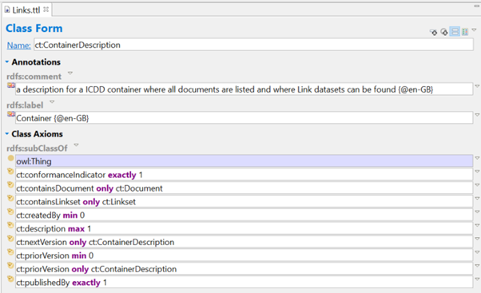

The Turtle expression of ‘container’: 

>```
>ct:ContainerDescription 
>  rdf:type owl:Class ; 
>  rdfs:comment "a description for a ICDD container where all documents are listed and where Link datasets can be found"@en-GB ; 
>  rdfs:label "Container"@en-GB ; 
>  rdfs:subClassOf owl:Thing ; 
>  rdfs:subClassOf [ 
>      rdf:type owl:Restriction ; 
>      owl:allValuesFrom ct:ContainerDescription ; 
>      owl:onProperty ct:nextVersion ; 
>    ] ; 
>  rdfs:subClassOf [ 
>      rdf:type owl:Restriction ; 
>      owl:allValuesFrom ct:ContainerDescription ; 
>      owl:onProperty ct:priorVersion ; 
>    ] ; 
>  rdfs:subClassOf [ 
>      rdf:type owl:Restriction ; 
>      owl:allValuesFrom ct:Document ; 
>      owl:onProperty ct:containsDocument ; 
>    ] ; 
>  rdfs:subClassOf [ 
>      rdf:type owl:Restriction ; 
>      owl:allValuesFrom ct:Linkset ; 
>      owl:onProperty ct:containsLinkset ; 
>    ] ; 
>  rdfs:subClassOf [ 
>      rdf:type owl:Restriction ; 
>      owl:cardinality "1"^^xsd:nonNegativeInteger ; 
>      owl:onProperty ct:conformanceIndicator ; 
>    ] ; 
>  rdfs:subClassOf [ 
>      rdf:type owl:Restriction ; 
>      owl:cardinality "1"^^xsd:nonNegativeInteger ; 
>      owl:onProperty ct:publishedBy ; 
>    ] ; 
>  rdfs:subClassOf [ 
>      rdf:type owl:Restriction ; 
>      owl:maxCardinality "1"^^xsd:nonNegativeInteger ; 
>      owl:onProperty ct:description ; 
>    ] ; 
>  rdfs:subClassOf [ 
>      rdf:type owl:Restriction ; 
>      owl:minCardinality "0"^^xsd:nonNegativeInteger ; 
>      owl:onProperty ct:createdBy ; 
>    ] ; 
>  rdfs:subClassOf [ 
>      rdf:type owl:Restriction ; 
>      owl:minCardinality "0"^^xsd:nonNegativeInteger ; 
>      owl:onProperty ct:priorVersion ; 
>    ] ; 
>. 
>```
 

 

## Document 

Here the class definition of ‘document’ is shown with its restrictions. 

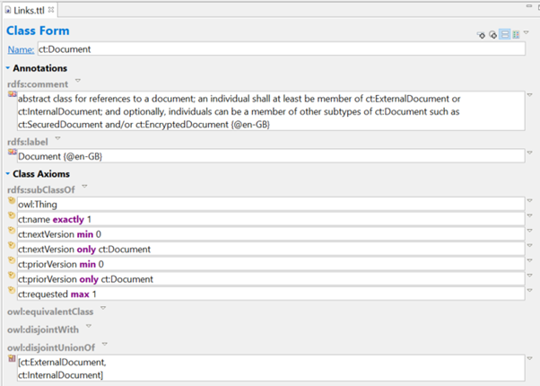

The Turtle expression of ‘document’: 

>```
>ct:InternalDocument 
>  rdf:type owl:Class ; 
>  rdfs:comment "a reference to a document inside a container"@en-GB ; 
>  rdfs:label "Internal document"@en-GB ; 
>  rdfs:subClassOf ct:Document ; 
>  rdfs:subClassOf [ 
>      rdf:type owl:Restriction ; 
>      owl:allValuesFrom xsd:string ; 
>      owl:onProperty ct:filename ; 
>    ] ; 
>  rdfs:subClassOf [ 
>      rdf:type owl:Restriction ; 
>      owl:cardinality "1"^^xsd:nonNegativeInteger ; 
>      owl:onProperty ct:belongsToContainer ; 
>    ] ; 
>  rdfs:subClassOf [ 
>      rdf:type owl:Restriction ; 
>      owl:cardinality "1"^^xsd:nonNegativeInteger ; 
>      owl:onProperty ct:filename ; 
>    ] ; 
>  rdfs:subClassOf [ 
>      rdf:type owl:Restriction ; 
>      owl:cardinality "1"^^xsd:nonNegativeInteger ; 
>      owl:onProperty ct:filetype ; 
>    ] ; 
>  owl:disjointWith ct:ExternalDocument ; 
>. 
>```

## Internal document 

Here the class definition of ‘internal document’ is shown with its restrictions. 

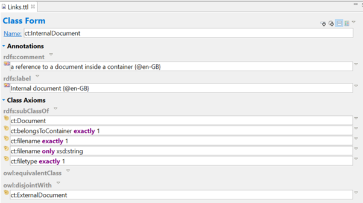

The Turtle expression of ‘internal document’: 

>```
>ct:InternalDocument 
>  rdf:type owl:Class ; 
>  rdfs:comment "a reference to a document inside a container"@en-GB ; 
>  rdfs:label "Internal document"@en-GB ; 
>  rdfs:subClassOf ct:Document ; 
>  rdfs:subClassOf [ 
>      rdf:type owl:Restriction ; 
>      owl:allValuesFrom xsd:string ; 
>      owl:onProperty ct:filename ; 
>    ] ; 
>  rdfs:subClassOf [ 
>      rdf:type owl:Restriction ; 
>      owl:cardinality "1"^^xsd:nonNegativeInteger ; 
>      owl:onProperty ct:belongsToContainer ; 
>    ] ; 
>  rdfs:subClassOf [ 
>      rdf:type owl:Restriction ; 
>      owl:cardinality "1"^^xsd:nonNegativeInteger ; 
>      owl:onProperty ct:filename ; 
>    ] ; 
>  rdfs:subClassOf [ 
>      rdf:type owl:Restriction ; 
>      owl:cardinality "1"^^xsd:nonNegativeInteger ; 
>      owl:onProperty ct:filetype ; 
>    ] ; 
>  owl:disjointWith ct:ExternalDocument ; 
>. 
>```


## Link set 

Here the class definition of ‘link set’ is shown with its restrictions. 

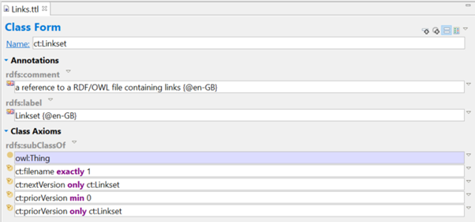

The Turtle expression of ‘link set’: 

>```
>ct:Linkset 
>  rdf:type owl:Class ; 
>  rdfs:comment "a reference to a RDF/OWL file containing links"@en-GB ; 
>  rdfs:label "Linkset"@en-GB ; 
>  rdfs:subClassOf owl:Thing ; 
>  rdfs:subClassOf [ 
>      rdf:type owl:Restriction ; 
>      owl:allValuesFrom ct:Linkset ; 
>      owl:onProperty ct:nextVersion ; 
>    ] ; 
>  rdfs:subClassOf [ 
>      rdf:type owl:Restriction ; 
>      owl:allValuesFrom ct:Linkset ; 
>      owl:onProperty ct:priorVersion ; 
>    ] ; 
>  rdfs:subClassOf [ 
>      rdf:type owl:Restriction ; 
>      owl:cardinality "1"^^xsd:nonNegativeInteger ; 
>      owl:onProperty ct:filename ; 
>    ] ; 
>  rdfs:subClassOf [ 
>      rdf:type owl:Restriction ; 
>      owl:minCardinality "0"^^xsd:nonNegativeInteger ; 
>      owl:onProperty ct:priorVersion ; 
>    ] ; 
>. 
>```


## Party 

Here the class definition of ‘party’ is shown with its restrictions. 

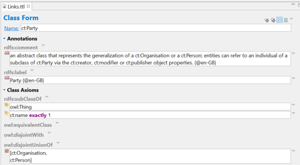

The Turtle expression of ‘party’: 

>```
>ct:Party 
>  rdf:type owl:Class ; 
>  rdfs:comment "an abstract class that represents the generalization of a ct:Organisation or a ct:Person; entities can refer to an individual of a subclass of ct:Party via the ct:creator, ct:modifier or ct:publisher object properties."@en-GB ; 
>  rdfs:label "Party"@en-GB ; 
>  rdfs:subClassOf owl:Thing ; 
>  rdfs:subClassOf [ 
>      rdf:type owl:Restriction ; 
>      owl:cardinality "1"^^xsd:nonNegativeInteger ; 
>      owl:onProperty ct:name ; 
>    ] ; 
>  owl:disjointUnionOf ( 
>      ct:Organisation 
>      ct:Person 
>    ) ; 
>. 
>```


## Organisation 

Here the class definition of ‘organisation’ is shown with its restrictions. 


The Turtle expression of ‘organisation’: 

>```
>ct:Organisation 
>
>  rdf:type owl:Class ; 
>
>  rdfs:comment "a class representing an organisation for provenance purposes"@en-GB ; 
>
>  rdfs:label "Organisation"@en-GB ; 
>
>  rdfs:subClassOf ct:Party ; 
>
>. 
>```

## Link 

Here the class definition of ‘link’ is shown with its restrictions. 

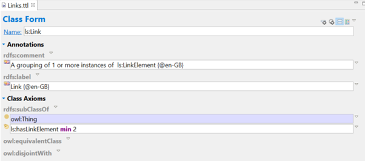

The Turtle expression of ‘link’: 

>```
>ls:Link 
>  rdf:type owl:Class ; 
>  rdfs:comment "A grouping of 1 or more instances of  ls:LinkElement"@en-GB ; 
>  rdfs:label "Link"@en-GB ; 
>  rdfs:subClassOf owl:Thing ; 
>  rdfs:subClassOf [ 
>      rdf:type owl:Restriction ; 
>      owl:minCardinality "2"^^xsd:nonNegativeInteger ; 
>      owl:onProperty ls:hasLinkElement ; 
>    ] ; 
>. 
>```

## Binary link 

Here the class definition of ‘binary link’ is shown with its restrictions. 

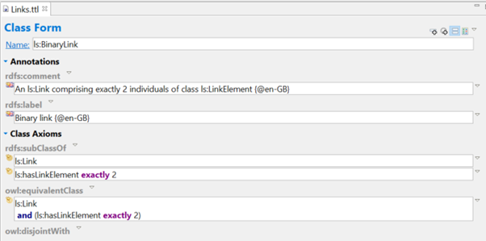

The Turtle expression of ‘binary link’: 

>```
>ls:BinaryLink 
>  rdf:type owl:Class ; 
>  rdfs:comment "An ls:Link comprising exactly 2 individuals of class ls:LinkElement"@en-GB ; 
>  rdfs:label "Binary link"@en-GB ; 
>  rdfs:subClassOf ls:Link ; 
>  rdfs:subClassOf [ 
>      rdf:type owl:Restriction ; 
>      owl:cardinality "2"^^xsd:nonNegativeInteger ; 
>      owl:onProperty ls:hasLinkElement ; 
>    ] ; 
>  owl:equivalentClass [ 
>      rdf:type owl:Class ; 
>      owl:intersectionOf ( 
>          ls:Link 
>          [ 
>            rdf:type owl:Restriction ; 
>            owl:cardinality "2"^^xsd:nonNegativeInteger ; 
>            owl:onProperty ls:hasLinkElement ; 
>          ] 
>        ) ; 
>    ] ; 
>. 
>```


## Directed link 

Here the class definition of ‘directed link’ is shown with its restrictions. 

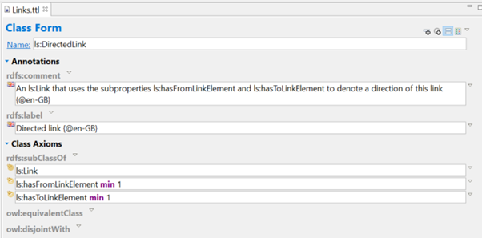

The Turtle expression of ‘directed link’: 

>```
>ls:DirectedLink 
>  rdf:type owl:Class ; 
>  rdfs:comment "An ls:Link that uses the subproperties ls:hasFromLinkElement and ls:hasToLinkElement to denote a direction of this link"@en-GB ; 
>  rdfs:label "Directed link"@en-GB ; 
>  rdfs:subClassOf ls:Link ; 
>  rdfs:subClassOf [ 
>      rdf:type owl:Restriction ; 
>      owl:minCardinality "1"^^xsd:nonNegativeInteger ; 
>      owl:onProperty ls:hasFromLinkElement ; 
>    ] ; 
>  rdfs:subClassOf [ 
>      rdf:type owl:Restriction ; 
>      owl:minCardinality "1"^^xsd:nonNegativeInteger ; 
>      owl:onProperty ls:hasToLinkElement ; 
>    ] ; 
>. 
>```
 

## Directed 1 to N link 

Here the class definition of ‘directed 1 to N link’ is shown with its restrictions. 

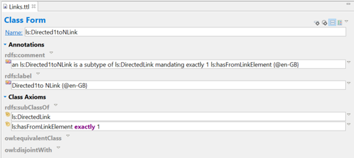

The Turtle expression of ‘directed 1 to N link’: 

>```
>ls:Directed1toNLink 
>  rdf:type owl:Class ; 
>  rdfs:comment "an ls:Directed1toNLink is a subtype of ls:DirectedLink mandating exactly 1 ls:hasFromLinkElement"@en-GB ; 
>  rdfs:label "Directed1to NLink"@en-GB ; 
>  rdfs:subClassOf ls:DirectedLink ; 
>  rdfs:subClassOf [ 
>      rdf:type owl:Restriction ; 
>      owl:cardinality "1"^^xsd:nonNegativeInteger ; 
>      owl:onProperty ls:hasFromLinkElement ; 
>    ] ; 
>. 
>```
 

## Link element 

Here the class definition of ‘link element’ is shown with its restrictions. 

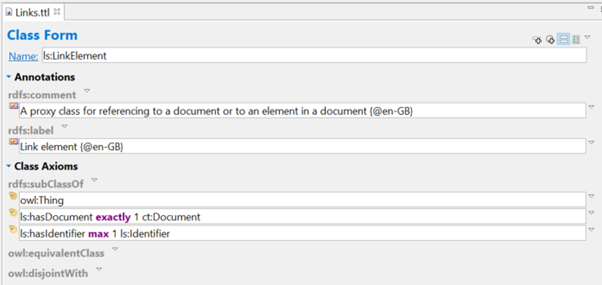

The Turtle expression of ‘link element’: 

>```
>ls:LinkElement 
>  rdf:type owl:Class ; 
>  rdfs:comment "A proxy class for referencing to a document or to an element in a document"@en-GB ; 
>  rdfs:label "Link element"@en-GB ; 
>  rdfs:subClassOf owl:Thing ; 
>  rdfs:subClassOf [ 
>      rdf:type owl:Restriction ; 
>      owl:maxQualifiedCardinality "1"^^xsd:nonNegativeInteger ; 
>      owl:onClass ls:Identifier ; 
>      owl:onProperty ls:hasIdentifier ; 
>    ] ; 
>  rdfs:subClassOf [ 
>      rdf:type owl:Restriction ; 
>      owl:onClass ct:Document ; 
>      owl:onProperty ls:hasDocument ; 
>      owl:qualifiedCardinality "1"^^xsd:nonNegativeInteger ; 
>    ] ; 
>. 
>```
 


## Container description example 

Here the example of ‘container 1’ is shown with its values. 

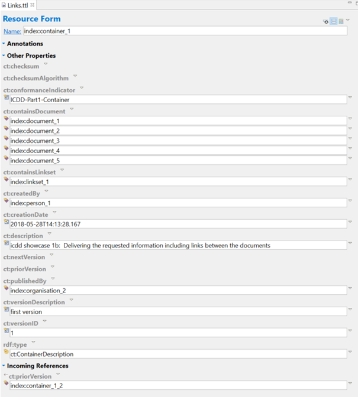

The Turtle expression of ‘container 1’: 

>```
>index:container_1 
>  rdf:type ct:ContainerDescription ; 
>  ct:conformanceIndicator "ICDD-Part1-Container" ; 
>  ct:containsDocument index:document_1 ; 
>  ct:containsDocument index:document_2 ; 
>  ct:containsDocument index:document_3 ; 
>  ct:containsDocument index:document_4 ; 
>  ct:containsDocument index:document_5 ; 
>  ct:containsLinkset index:linkset_1 ; 
>  ct:createdBy index:person_1 ; 
>  ct:creationDate "2018-05-28T14:13:28.167"^^xsd:dateTime ; 
>  ct:description "icdd showcase 1b:  Delivering the requested information including links between the documents" ; 
>  ct:publishedBy index:organisation_2 ; 
>  ct:versionDescription "first version" ; 
>  ct:versionID "1" ; 
>. 
>```

## Document examples 

Here the example of ‘document 5’ is shown with it’s values. 

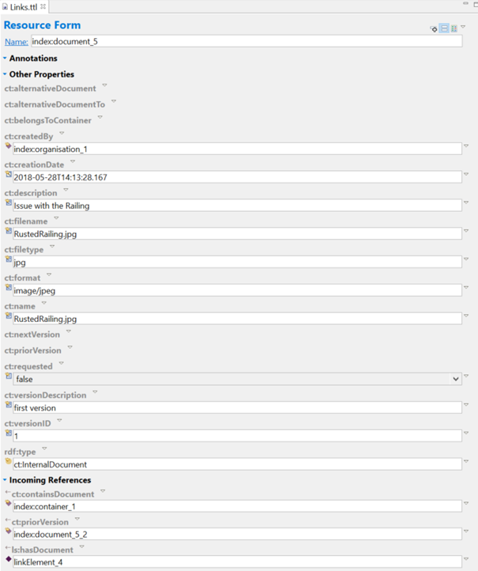
 
>```
>index:document_5 
>  rdf:type ct:InternalDocument ; 
>  ct:createdBy index:organisation_1 ; 
>  ct:creationDate "2018-05-28T14:13:28.167"^^xsd:dateTime ; 
>  ct:description "Issue with the Railing" ; 
>  ct:filename "RustedRailing.jpg" ; 
>  ct:filetype "jpg" ; 
>  ct:format "image/jpeg" ; 
>  ct:name "RustedRailing.jpg" ; 
>  ct:requested false ; 
>  ct:versionDescription "first version" ; 
>  ct:versionID "1" ; 
>. 
>```

## Link set example 

Here the example of ‘link set 1’ is shown with it’s values. 

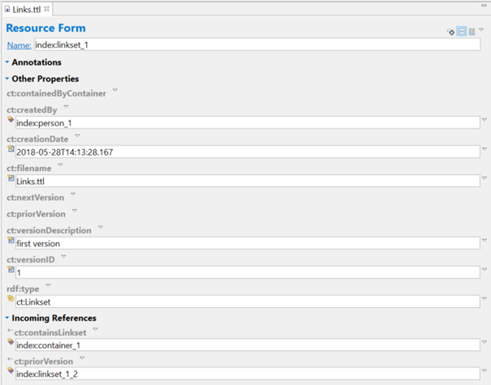

The Turtle expression of ‘link set 1’: 

>```
>index:linkset_1 
>  rdf:type ct:Linkset ; 
>  ct:createdBy index:person_1 ; 
>  ct:creationDate "2018-05-28T14:13:28.167"^^xsd:dateTime ; 
>  ct:filename "Links.ttl" ; 
>  ct:versionDescription "first version" ; 
>  ct:versionID "1" ; 
>. 
>```
 

## Organisation example 

Here the example of ‘organisation 1’ is shown with it’s values. 

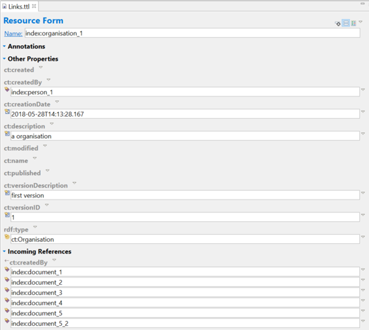

The Turtle expression of ‘organisation 1’: 

>```
>index:organisation_1 
>  rdf:type ct:Organisation ; 
>  ct:createdBy index:person_1 ; 
>  ct:creationDate "2018-05-28T14:13:28.167"^^xsd:dateTime ; 
>  ct:description "a organisation " ; 
>  ct:versionDescription "first version" ; 
>  ct:versionID "1" ; 
>. 
>```

## Binary link example 

Here the example of ‘binary link 1’ is shown with it’s values. 

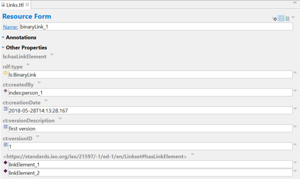

The Turtle expression of ‘binary link 1’: 

>```
>ex:binaryLink_1 
>  rdf:type ls:BinaryLink ; 
>  ct:createdBy index:person_1 ; 
>  ct:creationDate "2018-05-28T14:13:28.167"^^xsd:dateTime ; 
>  ct:versionDescription "first version" ; 
>  ct:versionID "1" ; 
>  ls:hasLinkElement ex:linkElement_1 ; 
>  ls:hasLinkElement ex:linkElement_2 ; 
>. 
>```
 

## Directed 1 to N link example 

Here the example of ‘directed 1 to N link 1’ is shown with it’s values. 

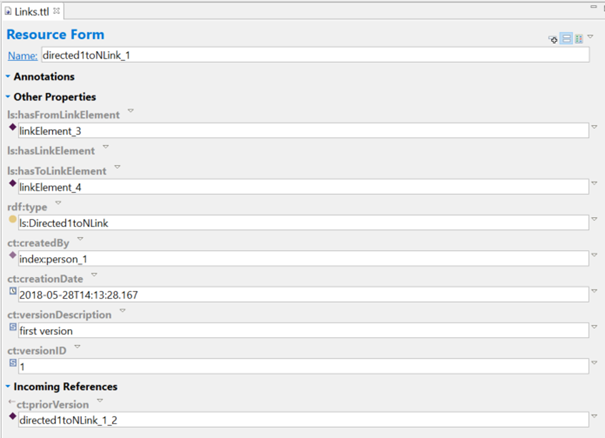

The Turtle expression of ‘directed link 1’: 

>```
>ex:directed1toNLink_1 
>  rdf:type ls:Directed1toNLink ; 
>  ls:hasFromLinkElement ex:linkElement_3 ; 
>  ls:hasToLinkElement ex:linkElement_4 ; 
>  ct:createdBy index:person_1 ; 
>  ct:creationDate "2018-05-28T14:13:28.167"^^xsd:dateTime ; 
>  ct:versionDescription "first version" ; 
>  ct:versionID "1" ; 
>. 
>```
 

## Link element example 

Here the example of ‘link element 4’ is shown with it’s values. 

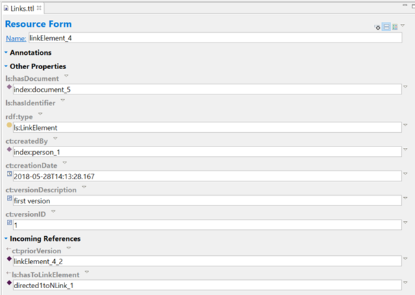

The Turtle expression of ‘link element 4’: 

>```
>ex:linkElement_4 
>  rdf:type ls:LinkElement ; 
>  ls:hasDocument index:document_5 ; 
>  ct:createdBy index:person_1 ; 
>  ct:creationDate "2018-05-28T14:13:28.167"^^xsd:dateTime ; 
>  ct:versionDescription "first version" ; 
>  ct:versionID "1" ; 
>.
>```
