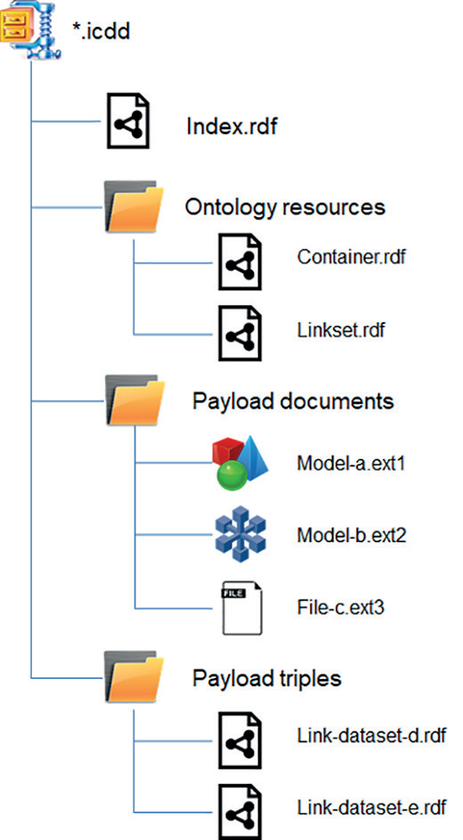

# Container validation

NEN-EN-ISO 21597-1:2020 containers are zip64 files with a predefined folder structure. See the following picture for the NEN-EN-ISO 21597-1:2020 container structure.

     
To check if containers are compliant to this structure, a set of checks can be developed and implemented. The following list contains a set of validation checks regarding the container file and its base structure. 

id   | check   |description   
--- | --- | --- 
CF1|valid zip 64 file|the file needs to be a valid ZIP64 file (ISO/IEC 21320-1)
CF2| existence of Index.rdf| an Index.rdf file needs to be present in the root folder in the container with the name "Index.rdf". 
CF3a|existence of 'Ontology resources'| An folder with the name 'Ontology resources' needs to be present in the root folder of the container 
CF3b|existence of 'Payload documents'| An folder with the name 'Payload documents' needs to be present in the root folder of the container. 
CF3c|existence of 'Payload triples'| An folder with the name 'Payload triples' needs to be present in the root folder of the container
CF4| rdf files in 'Ontology resources'|this folder may only contain "Linkset.rdf" and/or "Container.rdf" files.
CF5| valid file extension (.icdd)| the file extension needs to be '.icdd' 
CF6|no other root entries| no other files or folders are allowed in the root folder of the container| 
CF7|Linkset.rdf/Container.rdf validity| are these files valid NEN-EN-ISO 21597-1:2020 files?. It is unclear what is allowed here and what is not. A pragmatic file compare between the online resource and the files included in the container could be first step.

 
