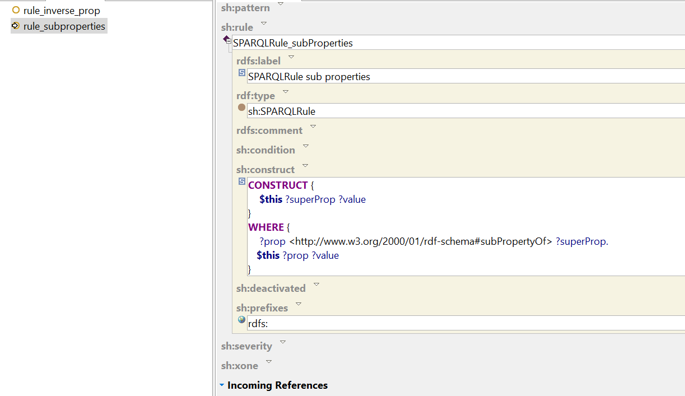
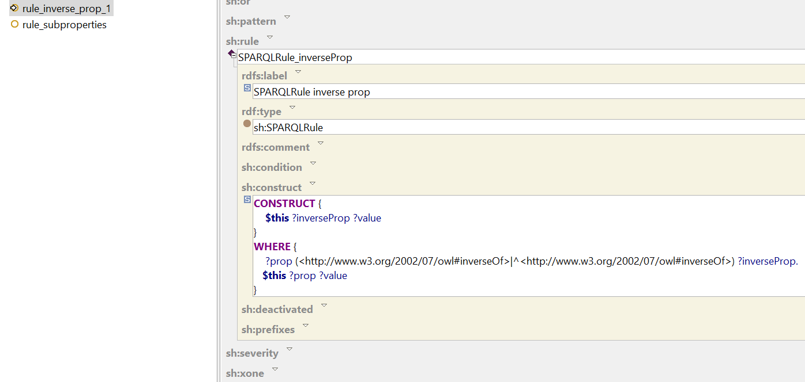
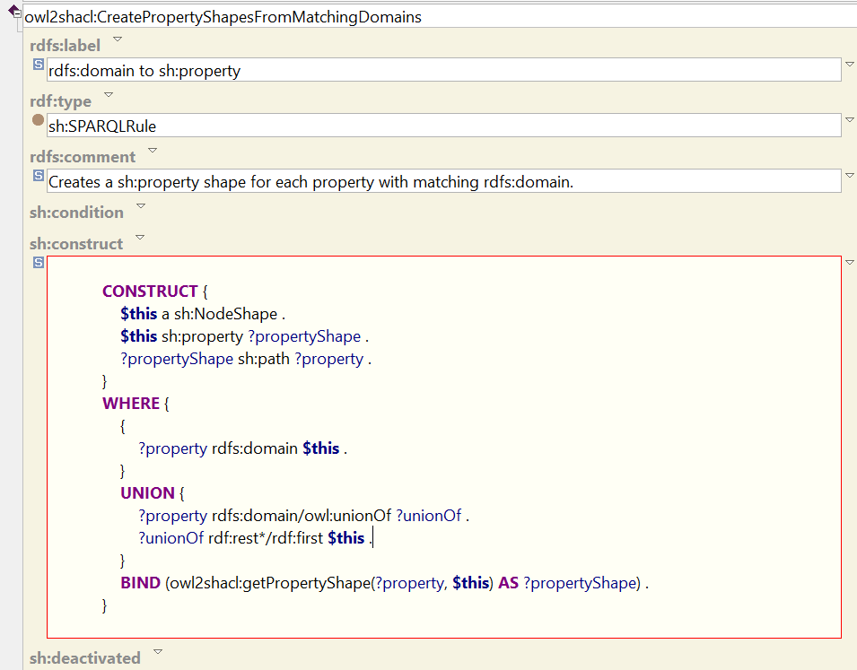
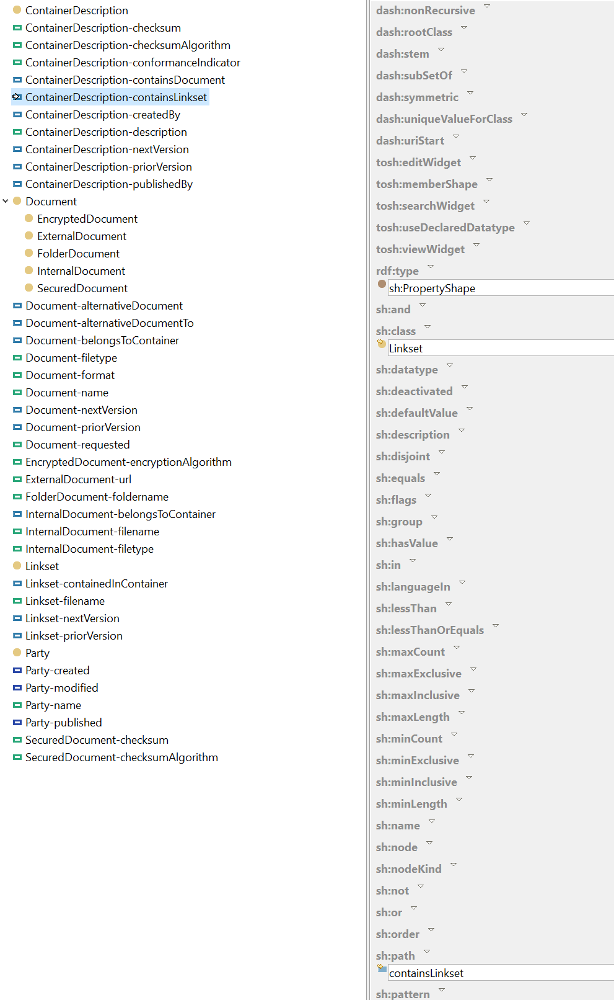

# Schema validation using SHACL

## Strategy
Different strategies can be used to implement schema validation of the index.rdf file and the linkset files. A 'plain' coding approach is very feasible. Using an implementation heavily using Sparql is also very feasible. Also the usage of Shacl seems very logical as suggested by the standard. 
This document investigates how to jumpstart a Shacl based validation approach by using the descriptions of Linkset.rdf and Container.rdf in combination with the official documentation to describe the necessary rules for schema validation. 

## Inference
Inferencing can be used as an implementation strategy. Without using inference you may need extra rules for validation or the individual validation rules might become more complex. Shacl supports entailment regimes but implementations are not required to support them. Given that ICDD redefines certain rdfs and owl definitions, only a small subset of rdfs and owl vocabulary remains that can used for inference. 

In case you want to use inference, the following rules can be applied. Arguably more rules can be used.

id   | inference  |description
--- | --- | ---
INF1| owl:subproperties| generate subproperty relations
INF2| owl:inverseOf properties| generate triples on the inverse properties and ^inverse properties. This enables easy testing of these added relationships.
INF3| rdfs:subClassOf |  generate rdf:type predicates based upon rdfs:subClassOf definitions
INF4| owl:unionOf*| generate rdf:type predicates based upon owl:unionOf rdf:list
INF5| owl:sameAs| copy predicates both ways. When sameAs constructs are available it is necessary that cardinality constraints take these constructs into account. 

*The interpretation of owl:unionClass is unclear in the specification: The ICDD model contains properties with domain objects with blank nodes containing a owl:unionOf predicate. It can be recommended that owl:unionClass is interpreted following the owl specification. Arguably this would be in line with the conversion of rdfs:domain and rdfs:range as restrictions for testing purposes. This means individuals must be typed accordingly.

Shacl has advanced features which enables so-called sparql rules. These are rules based upon a Sparql construct query which are connected to a Shacl Shape. The following screenshot shows a sparql rule. This rule adds superproperty values to each resource that has a value for a subproperty. This rule is connected to a shape targeting owl:Thing. Arguably the target class this can be further refined.

Another example is the inverse property rule where inverse properties are added. Multiple approaches to solve this are available. You could create a rule for setting inverseProperties. This means that when property A has an inverse property B than you could infer that property B has the inverse Property A. After this inference the actual values can be added to the dataset based upon inverse properties. Sequence of rule execution is very important and must be controlled. Another approach is to add inverse property values directly without inverse inference. The following screenshot gives an example of such a rule.

Regarding the two rules it is advisable to control the execution order of these rules. the Shacl property "order" takes an decimal value. Rules with smaller values will be executed first.

## Generating Shacl rules
The ICDD ontologies can be used to generate SHACL rules for testing ICDD datasets. TopBraid's OWL2Shacl rules can be used as a basis for this. The following list gives an example which rules can used to generate the necessary SHACL shapes for validating ICDD datasets.

id   | validation   |description   |
--- | --- | ---
SHGen1| Datatype check| check if all datatype values have the correct datatype
SHGen2| Object relations check |the norm uses domain and ranges as a constraint: check if the range and domain are valid for all object relations*  
SHGen3| Resource typing check | check if all resources are sufficiently typed. Make sure all resources are typed to minimal one non-blank valid Class
SHGen4| Cardinality check|the norm uses owl cardinality as constraints: check cardinality and take owl:sameAs into account or skip it and report that it cannot perform these checks when owl:sameAs is present.
SHGen5| Disjoint check| check if individuals are not member of disjoint classes
SHGen6| domain check | interpret domain as a restriction and consequently test if properties with a a domain are used by resources that are typed accordingly.*
SHGen7| range check|  interpret range as a restriction and consequently test if the object of a property with a range is typed accordingly.

*TopBraid's owl2shacl rule for domain checks also takes a unionclass construct into account. Inference rule 4 (INF4) can be disregarded in this case.

## SHACL validation rules
Using the ICDD ontologies and the Shacl generating rules, a strong basis for a Shacl file for testing ICDD can be generated. After executing the sparql rules these shacl shapes can be used for testing ICDD containers. This paragraph gives examples of these SHACL shapes.

#### Datatype checks
The following screenshot shows the generated Shacl property shape for testing 'document-name'.  This shape checks if the datatype is a string for this property. This shape also checks if this property is available (min cardinality is 1, max cardinality is 1)

#### Cardinality checks
The following screenshot shows the generated cardinality shape for BinaryLink. A Binarylink must have 2 'hasLinkElements'. This is modelled using a minimal cardinality of 2 and a maximum cardinality of 2 for the path 'hasLinkElement'.

#### Domain & range checks
Domain and ranges are interpreted as restrictions in ICDD. This means that properties with a range and domain can only be used between resources that match respectively the range and domain (type). The following screenshot shows a shacl shape for ContainerDescriptions. The property containsLinkset can only be a resource typed as a Linkset. 

#### Other checks
The ICDD specification contains a Shacl file for testing Link datasets on class types. This can be used to verify that Link datasets do not contain new document references because these should reside in the index.rdf file.

## Shacl files
The following shaclfiles are available for example purposes:
* [shacl inference rules](./media/icdd/Example_ICDD_inferencerules_Shacl.rdf)
* [index shacl file](./media/icdd/Container.shapes.rdf)
* [linkset shacl file](./media/icdd/Linkset.shapes.rdf)

